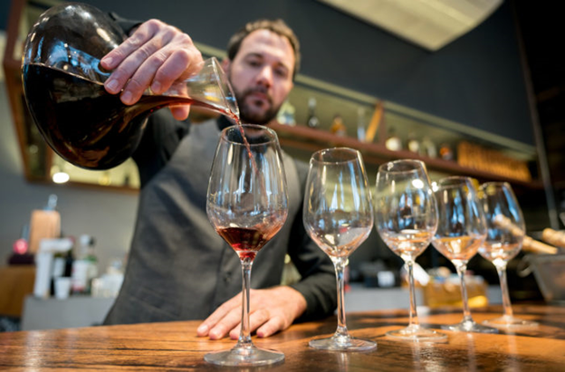

  
  #    
  

# Final Project - Vine & Vault

                          

## Table of Contents
* [Presentation](#Presentation) 
    * [Predictive Wine Ratings](#Predictive-Wine-Ratings) 
    * [Technologies Used](#Technologies-Used) 
          *  [Data Cleaning and Analysis](#Data-Cleaning-And-Analysis) 
          *  [Database Storage](#Database-Storage) 
          *  [Machine Learning](#Machine-Learning) 
          *  [Dashboard](#Dashboard) 
* [GitHub](#GitHub) 
    * [Communication Protocols](#Communication-Protocols) 
* [Machine Learning Model](#Machine-Learning-Model) 
    * [Question we would like to answer with our machine learning model](#Question-we-would-like-to-answer-with-our-machine-learning-model) 
    * [Machine Learning Model](#Machine-Learning-Model) 
    * [Output Label](#Output-Label) 
    * [Model Accuracy](#Model-Accuracy) 
    * [Data Preprocessing](#Data-Preprocessing) 
    * [How the model works](#How-the-model-works) 
* [Database](#Database)
    * [Dataset](#Dataset) 

## Presentation

#### <ins><b>Predictive Wine Ratings</ins></b>  ####
For this repository we chose to explore data from Wine Magazine to determine if we can recommend a bottle of wine for a novice wine drinker based on such things as price, rating, variety, region and year.  We selected this topic because we're a group of wine enthusiasts but we're certainly no sommeliers. Since wine can be complicated and overwhelming, we wanted to create a fun and interactive way for novice wine drinkers to discover new wines. We hope to be able to plug variables into our machine learning model and have it output a predicted rating of a given wine. Our dataset was posted on Kaggle and compiled by Wine Magazine. For a more in depth look at our presentation please see the [Vine & Vault]( https://docs.google.com/presentation/d/1Y30czQ6kugodLCrJLLdQ3cycAYm2OTq6B37aSAKsT3E/edit?usp=sharing) google slides.  

  
  
  

#### <ins><b>Technologies Used</ins></b>  ####

* ##### <b>Data Cleaning and Analysis</b>  #####
  We performed our data transformation and analysis with Python and Pandas using Jupyter Notebook. All members of the group were familiar with Pandas so this came as an easy decision and allowed the analysis to run smoothly. See [Wine_Ratings.ipynb](https://github.com/whitneyshine/austin_project/blob/main/Wine_Ratings.ipynb) for the code that transformed and analyzed our data. 
* ##### <b>Database Storage</b>  #####
  We used PostgresSQL for database storage. Connections to our SQL database were created in our machine learning and data analysis notebooks. Again, this decision was made due to familiarity. 
* ##### <b>Machine Learning</b>  #####
  For the machine learning portion, we chose to use a SciKitLearn Random Forest model due to the algorithm's high degree of accuracy, the reduced chance of overfitting, and the need to use a supervised model. 
* ##### <b>Dashboard</b>  #####
  We built our dashboard using [Tableau](https://public.tableau.com/app/profile/eileen7390/viz/VineVault/Dashboard2)
 and will later integrate it with a Flask template and host on Google App Engine for a complete and polished location to access and view all the elements of our final project.  Interact with the Dashboard by selecting a desired country from our dropdown feature or maybe you are looking for a specific price point - we have that covered in a slide scale in the upper left-hand corner.   

## GitHub
#### <ins><b>Communication Protocols</ins></b>   ####

  

 

For our group communication protocols, we will be using the following modes of communication: 
* Phone 
* Text 
* Zoom 
* Slack 
* Email  

  

## Machine Learning Model

#### <ins><b>Question we would like to answer with our machine learning model</ins></b>  ####
Can a machine learning model be trained to rate wine like an experienced sommelier?   
#### <ins><b>Machine Learning Model</ins></b>  ####
We chose a random forest model since we need a supervised learning model. Random forest algorithms are great to use for classification or regression problems and typically produce a higher degree of accuracy. The model does a good job to avoid overfitting and it can efficiently handle large datasets like ours. The biggest downside to using this type of model is computing time. The model can take hours to fit to the training data making it very time consuming to optimize.  
#### <ins><b>Output Label</ins></b>  ####
Our machine learning model's output label is a wine rating -- a continuous value between 80 and 100 -- otherwise known as "points" in the dataset.   
#### <ins><b>Model Accuracy</ins></b>  ####
Let's face it -- no one will die if they drink a glass of wine that is rated inaccurately. If our model predicts some vintages to rate below their actual rating, it will be unfortunate. The consumer may notice and be unhappy. However, it's possible that the consumer will not notice and drink the wine anyway.   
#### <ins><b>Data Preprocessing</ins></b>  ####
Our initial dataset was fairly robust with lots of data but offered a limited number of features to analyze and explore. Therefore, we made the following transformations: 
* We extracted the year the wine was made by searching the title column for a regular expression then added it as an extra feature to our dataset, focusing on production years 2000 to present.
* We used dictionary keys to look in the description, variety and title columns and assigned a red or white designation. We added this feature as an additional column called wine type.
* We added a column to group ratings into 5 categories -- below average, average, good, very good and excellent. This feature will add context and value to our consumer-friendly dashboard, however we are not using it to train our machine learning model since it’s derived from the feature we are trying to predict.
* We replaced null values in the region_1 column with province name and in the taster_name column with unknowns
* In our final transformation, we dropped the description and designation columns since they presented computational challenges for our machine learning model and dropped the region_2 and taster_twitter_handle columns because they didn’t add value to our model or dashboard.
 

Please see [Wine_Ratings.ipynb](https://github.com/whitneyshine/austin_project/blob/main/Wine_Ratings.ipynb) for the code that transformed our dataset.
  

#### <ins><b>How the model works</ins></b>  ####
Please see [MLModel_flowchart](https://github.com/whitneyshine/austin_project/blob/main/MLModel_flowchart.png) for a flowchart of the process for our [machine learning model](https://github.com/whitneyshine/austin_project/blob/main/MLModel.ipynb).  The model first connects to a SQL database to read the dataset into a pandas dataframe. Then the data is cleaned of any unneeded columns (such as taster twitter handle) as well as columns with a large amount of unique values (such as the title column) that will cause the model to break. Once the data is ready, the categorical columns are split into binary data using scitkit-learn’s One Hot Encoder. This tool creates a new column for each unique value in the previous columns which can make the dataset quite larger than before. The data is then split using scikit-learn’s Train Test Split method into 75% training data and 25% testing data. Finally, the model can be fit to the data. This is the most time consuming part of the process. At 100 estimators the model took about an hour to fit to the data.   

  
  

## Database  

#### <ins><b>Dataset</ins></b>  ####
Our dataset contains information on the type of wine, country, region, and winery where it was created as well as the price per bottle, wine rating, and a description about the wine.  The original data was created by [Wine Enthusiast](https://www.winemag.com/ratings/?utm_source=wineenthusiast.com&utm_medium=affiliate&utm_content=topnav) and the [Wine Dataset](https://www.kaggle.com/zynicide/wine-reviews) was found on Kaggle.  As a Team for this Project, we used a SQL database - please see our [Entity Relationship Diagram (ERD)](https://github.com/whitneyshine/austin_project/blob/main/QuickDBD-Winemag_data.png) with relationships.
  

  

