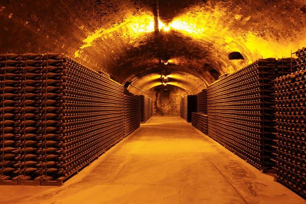

  
  #    
  

# Final Project - Wine Ratings

                          

## Table of Contents
* [Presentation](#Presentation) 
    * [Predictive Wine Ratings](#Predictive-Wine-Ratings) 
    * [Technologies Used](#Technologies-Used) 
          *  [Data Cleaning and Analysis](#Data-Cleaning-And-Analysis) 
          *  [Database Storage](#Database-Storage) 
          *  [Machine Learning](#Machine-Learning) 
          *  [Dashboard](#Dashboard) 
* [GitHub](#GitHub) 
    * [Communication Protocols](#Communication-Protocols) 
* [Machine Learning Model](#Machine-Learning-Model) 
    * [Question we would like to answer with our machine learning model](#Question-we-would-like-to-answer-with-our-machine-learning-model) 
    * [Machine Learning Model](#Machine-Learning-Model) 
    * [Output Label](#Output-Label) 
    * [Model Accuracy](#Model-Accuracy) 
    * [How the model works](#How-the-model-works) 
* [Database](#Database)
    * [Dataset](#Dataset) 

## Presentation

#### <ins><b>Predictive Wine Ratings</ins></b>  ####
For this repository we have created a machine learning model that can predict the rating of wine based on various inputs such as price, origin, and variety. This topic was selected because it offers descriptive features that the model can learn from and was also just interesting to us as a team. This data set was posted on Kaggle and compiled by Wine Magazine. We hope to be able to plug variables into the model and have it output a predicted rating of a given wine.  

  
  
  

#### <ins><b>Technologies Used</ins></b>  ####

* ##### <b>Data Cleaning and Analysis</b>  #####
  Pandas will be used to clean and prepare our data for analysis. All members of the group are familiar with Pandas so this came as an easy decision and should allow the   analysis to run smoothly. 
* ##### <b>Database Storage</b>  #####
  PostgresSQL will be used for database storage. We will also be using a Flask template to display the data. Again, this decision was made due to familiarity. 
* ##### <b>Machine Learning</b>  #####
  For the machine learning portion, we have chosen to use a SciKitLearn Random Forest model. This was chosen due to a high degree of accuracy, the reduced chance of overfitting using this model as well as the need to use a supervised model. 
* ##### <b>Dashboard</b>  #####
  For our dashboard, we plan on using Python 3 along with a Flask template which will then be hosted on Google Cloud Console.  

## GitHub
#### <ins><b>Communication Protocols</ins></b>   ####

  

 

For our group communication protocols, we will be using the following modes of communication: 
* Phone 
* Text 
* Zoom 
* Slack 
* Email  

  

## Machine Learning Model

#### <ins><b>Question we would like to answer with our machine learning model</ins></b>  ####
Can we accurately predict a wine's rating based on several factors such as price, grape variety, and region of origin?  
#### <ins><b>Machine Learning Model</ins></b>  ####
We chose a random forest model since we need a supervised learning model. Random forest algorithms are great to use for classification or regression problems and typically produce a higher degree of accuracy. The model does a good job to avoid overfitting and it can efficiently handle large datasets like ours.  
#### <ins><b>Output Label</ins></b>  ####
Our machine learning model's output label is a wine rating -- a continuous value between 80 and 100 -- otherwise known as "points" in the dataset.   
#### <ins><b>Model Accuracy</ins></b>  ####
Let's face it -- no one will die if they drink a glass of wine that is rated inaccurately. If our model predicts some vintages to rate below their actual rating, it will be unfortunate. The consumer may notice and be unhappy. However, it's possible that the consumer will not notice and drink the wine anyway.   
#### <ins><b>How the model works</ins></b>  ####
Please see [MLModel_flowchart](https://github.com/whitneyshine/austin_project/blob/main/MLModel_flowchart.png) for a flowchart of the process for our [machine learning model](https://github.com/whitneyshine/austin_project/blob/main/MLModel.ipynb).  For now, the csv file (which is our provisional database) is being read in to our Python File.  Later in our project, we intend to connect to our SQL Database.   

  
  

## Database  

#### <ins><b>Dataset</ins></b>  ####
Our dataset contains information on the type of wine, country, region, and winery where it was created as well as the price per bottle, wine rating, and a description about the wine.  The original data was created by [Wine Enthusiast](https://www.winemag.com/ratings/?utm_source=wineenthusiast.com&utm_medium=affiliate&utm_content=topnav) and the [Wine Dataset](https://www.kaggle.com/zynicide/wine-reviews) was found on Kaggle.  As a Team for this Project, we will be using a SQL database - please see our [Entity Relationship Diagram (ERD)](https://github.com/whitneyshine/austin_project/blob/main/QuickDBD-Winemag_data.png) with relationships.
  

  

